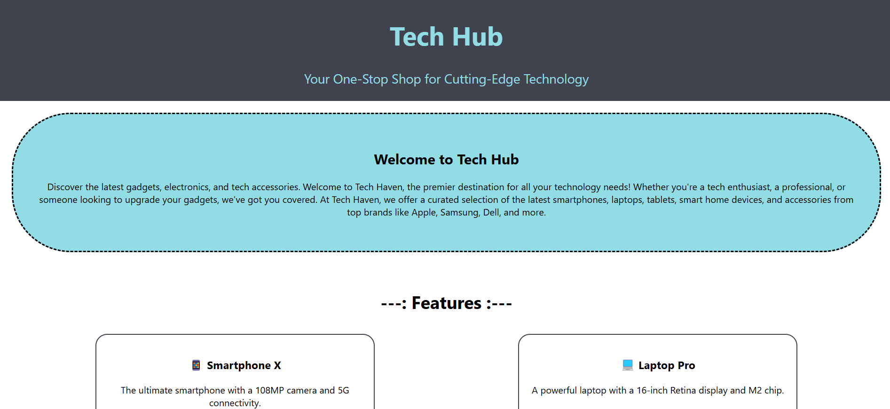
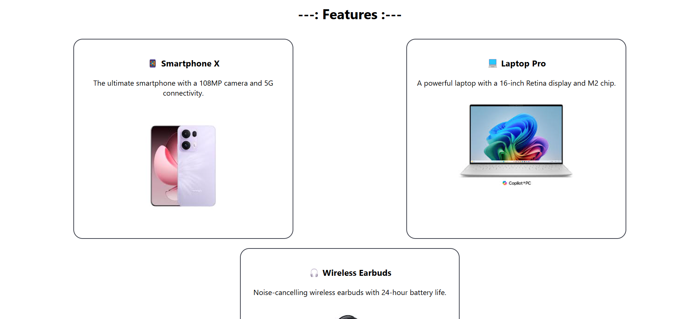

# Tech Hub - Configurable React UI Project

This is a simple React project that demonstrates how to create a configurable UI using a `config.js` file. The project is designed for a tech product store called **Tech Hub**, where the content of the UI can be easily customized from a single configuration file.

---

## Features
- **Configurable UI**: All content is managed through a `config.js` file.
- **Responsive Design**: The UI is designed to work seamlessly on all devices.
- **Dynamic Content**: Easily update the store's name, slogan, products, and more without touching the component code.

---

## Screenshots

### Home Page
  
*Replace this URL with the actual screenshot of your home page.*

### Featured Products Section
  
*Replace this URL with the actual screenshot of your featured products section.*

---

## Project Structure

```configui/
├── public/
├── src/
│ ├── components/
│ │ ├── Header.js
│ │ ├── HeroSection.js
│ │ ├── Features.js
│ │ ├── Footer.js
│ ├── config.js
│ ├── App.js
│ ├── index.js
├── package.json```